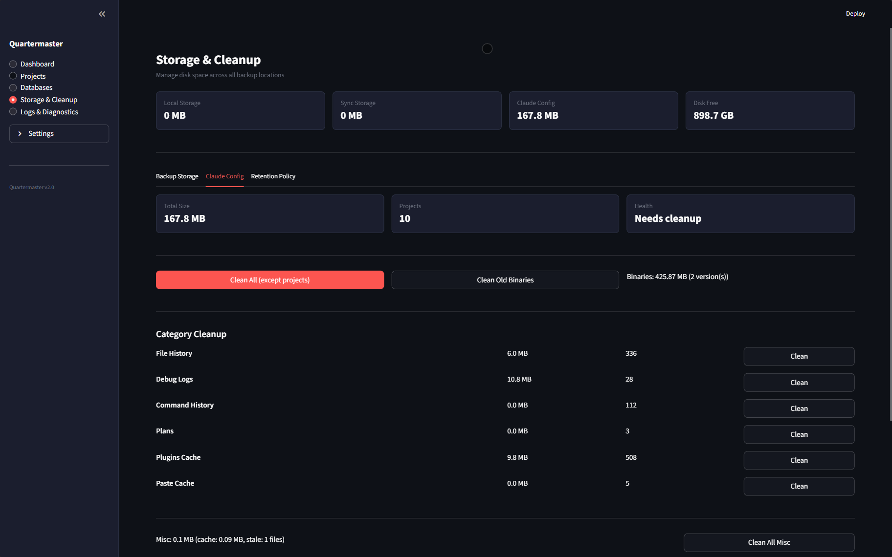
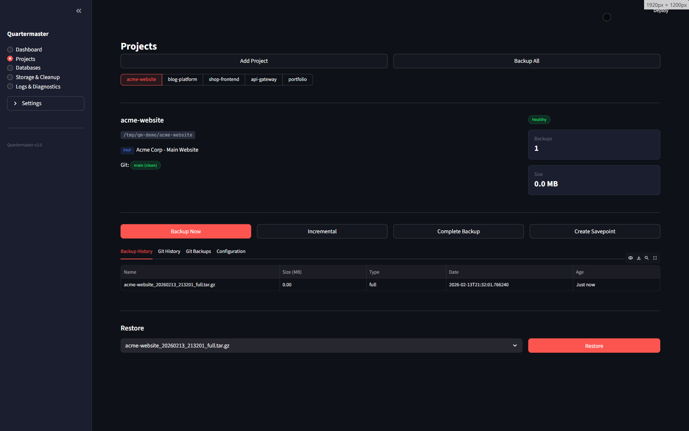
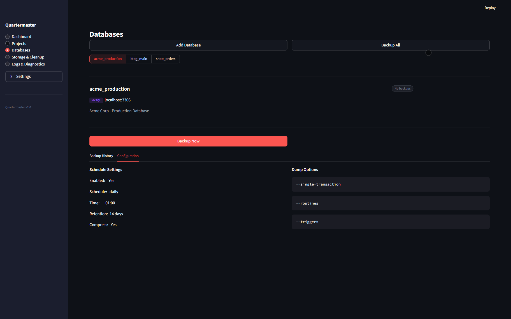
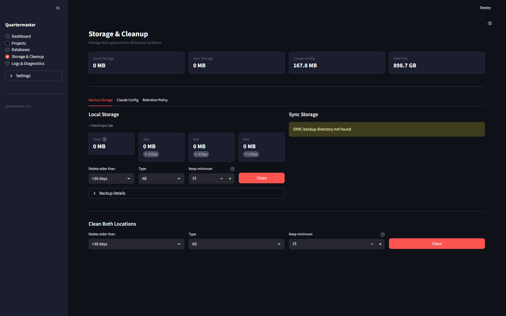
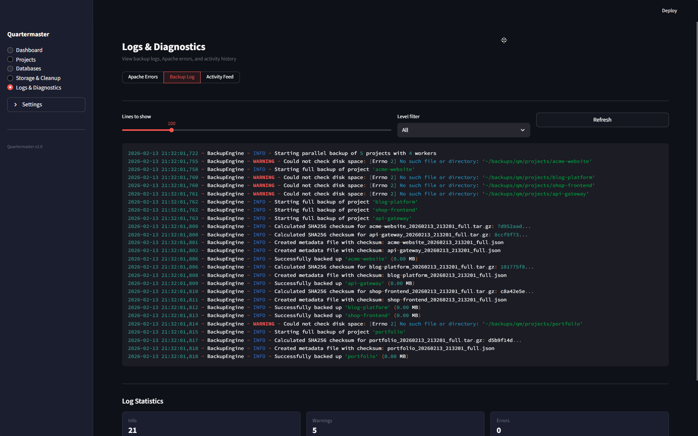

# Quartermaster

A grab-bag of tools I built because I kept needing them.

I manage a few projects, databases, and I got tired of doing the same stuff manually - backups, checking logs, cleaning up junk, converting things. So I started building tools for it. First it was just backups. Then I needed a log reader. Then a way to clean up Claude Code's `.claude` directories that were eating my disk. Then HTML cleaning. It just keeps growing.

It's a Streamlit dashboard and a CLI. Nothing fancy, but it works for me.

The name? I wanted something that handles the maintenance stuff I keep putting off - things that should happen at least **quarterly**. Quarterly → Quartermaster → `qmaster`.

> **Built with [Claude Code](https://claude.ai/code).** I'm not a developer - I'm a product/telecom guy who wanted to solve real problems and see what Claude Code can do. [More on that below.](#how-this-got-made)

## What's in here

**Backups** - Full and incremental project backups, MySQL dumps with encrypted passwords, git savepoints. Every backup gets a SHA256 checksum. Retention policies handle cleanup so old archives don't pile up forever. Optional sync to a NAS or external drive.


**Log reading** - Apache and PHP log parsing with search, severity filtering, stats. Because `grep` gets old when you're digging through access logs at 11 PM.

**Claude Code cleanup** - Scans your projects for `.claude` directories, shows you what's eating space, lets you clean by category or blow it all away. I built this after noticing 500+ MB of stale Claude data scattered around.



**HTML cleaner** - Paste or upload HTML, pick an output format: Markdown, structural HTML (classes and IDs but no style garbage), minimal HTML (barely any attributes), or plain text. Mostly use this before feeding content to AI or cleaning up docs.

**The rest:**
- Incremental and full tar.gz project archives
- MySQL/MariaDB dumps, compressed, passwords encrypted at rest
- Git savepoints and portable bundles
- Streamlit dashboard + CLI (use whichever)
- Dashboard catches overdue backups on startup and runs them in the background
- Hourly/daily/weekly/monthly retention tiers
- SHA256 checksums on everything
- Secondary sync to NAS, external drive, whatever
- Cron scheduling
- Storage analytics with cleanup suggestions

I'll keep adding stuff as I need it.

## Quick start

```bash
git clone https://github.com/imisic/qmaster.git
cd qmaster

# Setup (creates venv, installs deps, copies example configs)
./setup.sh

# Configure your stuff
nano config/settings.yaml     # Storage paths, defaults
nano config/projects.yaml     # Your projects
nano config/databases.yaml    # Database connections (passwords auto-encrypt on first run)

# Run it
./run.sh                      # Dashboard at http://localhost:8501
./run.sh status               # CLI works too
./run.sh backup --all
```

> **No auth on the dashboard.** It's meant for localhost. Don't put it on the internet without something in front of it.

## CLI

```bash
./run.sh backup --all                         # Backup all projects
./run.sh backup --project my-website -i       # Incremental
./run.sh backup-db --all                      # All databases
./run.sh snapshot my-website -m "before refactor"  # Git + project + DB at once

./run.sh restore my-website backup.tar.gz
./run.sh restore-db my_app_db backup.sql.gz

./run.sh status
./run.sh verify --project my-website --all    # Check checksums
./run.sh cleanup --dry-run                    # See what would get deleted
./run.sh storage --detailed

./run.sh apache-logs --lines 100 --severity error
./run.sh php-logs --project my-website --summary
```

## Config

Config files are in `config/`, gitignored. Only `.example` templates are tracked.

**Projects** (`projects.yaml`) - path, type, exclusions, git settings, schedule. Can auto-discover from a parent directory too.

**Databases** (`databases.yaml`) - connection details. Write passwords in plain text, Quartermaster encrypts them with Fernet on first load and swaps them for `enc:` values. Key is stored `0600`, gitignored.

**Settings** (`settings.yaml`) - storage paths, retention, timeouts, dashboard stuff.

<details>
<summary>Settings reference</summary>

| Setting | Default | What it does |
|-|-|-|
| `storage.local_base` | `~/backups/qm` | Where backups go |
| `storage.secondary_sync` | *(none)* | Second location (NAS, external drive) |
| `defaults.project.schedule` | `daily` | Default backup schedule |
| `defaults.project.retention_days` | `30` | How long to keep project backups |
| `defaults.database.retention_days` | `14` | How long to keep database backups |
| `system.max_parallel_backups` | `4` | Concurrent backup jobs |
| `web.port` | `8501` | Dashboard port |

</details>

## Works on

**Linux** and **Windows via WSL** (both tested). **macOS** probably works but I haven't tried - Apache log paths might need tweaking.

Needs: Python 3.10+, `mysqldump`, `git`, `cron`.

## Screenshots

<details>
<summary>More screenshots</summary>

### Projects


### Databases


### Storage & Cleanup


### Logs & Diagnostics


</details>

<details>
<summary>Security stuff</summary>

- Database passwords encrypted at rest (Fernet: AES-128-CBC + HMAC-SHA256)
- Encryption key stored `0600`, gitignored
- MySQL creds passed via temp config files, not CLI args
- Backup files created `0600`
- Tar extraction has path traversal protection
- All subprocess calls use list format (no shell injection)

</details>

## How this got made

I started small. I wanted a way to check Apache logs without digging through the terminal. Then I needed proper backups. Then database backups. Then Claude Code cleanup. Then HTML cleaning. One thing led to another and it just keeps going.

The whole thing was built with [Claude Code](https://claude.ai/code). I'm not a developer - I work in product/telecom and wanted to see what Claude Code can actually do when you throw real problems at it. Turns out, quite a lot. I described what I needed, we went back and forth, and it kept growing.

Fair warning: when I started this, I barely understood git. Like, "what do you mean I have to *stage* before I *commit*?" levels of clueless. Branches, rebasing, pull requests - might as well have been in Latin. I'm still not fluent, but building this was probably the best git tutorial I never signed up for.

Can't promise it handles every edge case. It works for my setup: a few PHP and Python projects on WSL with MySQL. The code is here though, and if it's useful to you, cool.

**Bugs and ideas welcome.** See [CONTRIBUTING.md](CONTRIBUTING.md).

## License

MIT - see [LICENSE](LICENSE).
