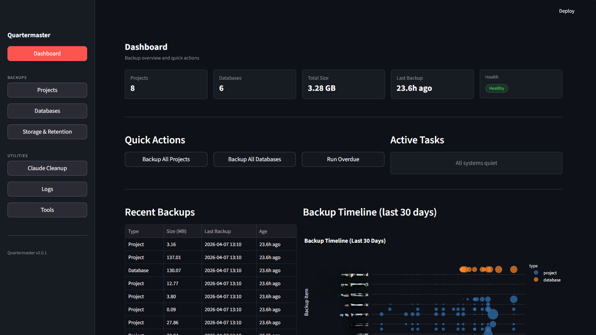
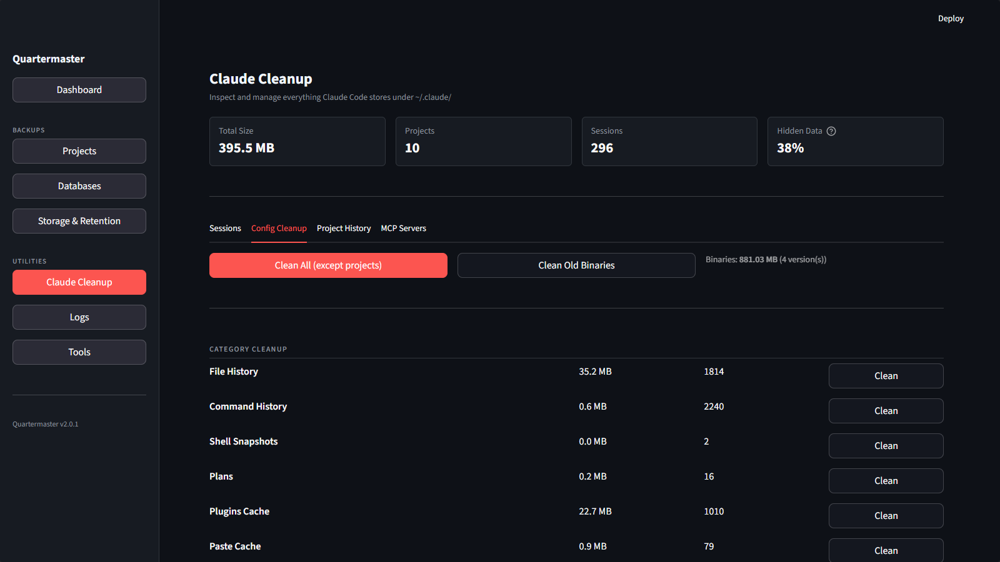
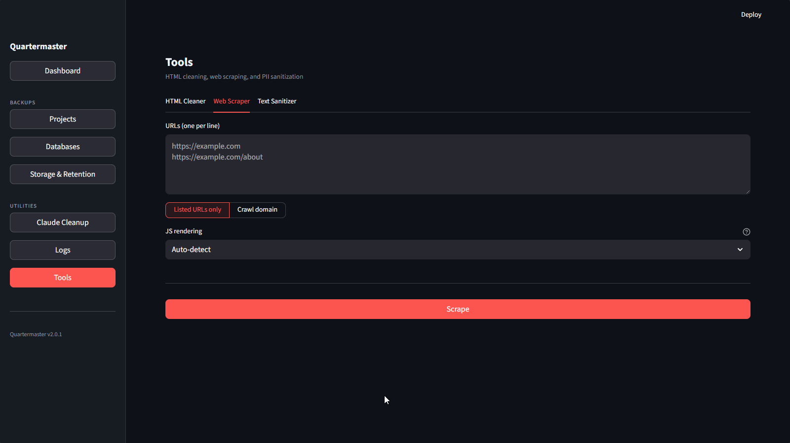

# Quartermaster

Tools I built because I kept needing them. Backups, log reading, cleanup utilities, converters. It started as just backups and kept growing.

Streamlit dashboard + CLI. Nothing fancy, but it works.

The name? Maintenance stuff I keep putting off, things that should happen at least **quarterly**. Quarterly -> Quartermaster -> `qmaster`.

> **Built with [Claude Code](https://claude.ai/code).** I'm not a developer, I'm a product guy who wanted to solve real problems and see what Claude Code can do. [More on that below.](#how-this-got-made)

## Features

**Backups** - Full and incremental project archives, MySQL dumps with encrypted passwords, git savepoints and portable bundles. SHA256 checksums on everything. Retention policies, tagging, pinning. Optional sync to NAS or external drive.



**Log reader** - Apache and PHP log parsing with search, severity filtering, stats, export.

**Claude Code cleanup** - Scans for `.claude` directories eating your disk, shows what's taking space, lets you clean by category. On WSL it finds both Linux and Windows-side directories.

**Tools** - HTML cleaner (HTML to Markdown, plain text, or stripped HTML), web scraper (URLs to clean Markdown, optional JS rendering, domain crawl), and text sanitizer (strip PII before sharing).

## Quick start

```bash
git clone https://github.com/imisic/qmaster.git
cd qmaster
./setup.sh            # venv, deps, example configs
./run.sh init         # discover projects, databases, Claude dirs
./run.sh              # dashboard at http://localhost:8501
```

`setup.sh` creates the venv, installs dependencies, and copies example configs. On WSL it places the venv on the Linux filesystem for speed and can create a Windows desktop shortcut. Pass `--non-interactive` for CI/scripts.

`./run.sh init` scans your machine for git projects, detects running MySQL databases, and finds Claude Code directories. Pick what you want, it writes the config.

Or edit configs manually in `config/` (settings, projects, databases). Only `.example` templates are tracked in git.

> **No auth on the dashboard.** It's meant for localhost. Don't expose it without something in front of it.

## CLI

```bash
./run.sh backup --all                         # Backup all projects
./run.sh backup --project my-website -i       # Incremental
./run.sh backup-db --all                      # All databases
./run.sh snapshot my-website -m "before refactor"  # Git + project + DB

./run.sh restore my-website backup.tar.gz
./run.sh restore-db my_app_db backup.sql.gz

./run.sh status
./run.sh verify --project my-website --all
./run.sh cleanup --dry-run
./run.sh storage --detailed

./run.sh apache-logs --lines 100 --severity error
./run.sh php-logs --project my-website --summary
./run.sh sanitize
```

<details>
<summary>More commands</summary>

```bash
# Git-specific
./run.sh backup-git --project my-website
./run.sh restore-git my-website bundle.git
./run.sh backup-complete --project my-website

# Inspect backups without restoring
./run.sh list-files my-website backup.tar.gz
./run.sh preview-file my-website backup.tar.gz src/app.py
./run.sh restore-files my-website backup.tar.gz "*.py" --target /path

# Tagging and retention
./run.sh tag --project my-website backup.tar.gz --tags production --pin
./run.sh list-tagged
./run.sh retention --status
./run.sh backfill-checksums

# Logs
./run.sh export-apache-logs --format csv
./run.sh php-report
```

</details>

## Config

Config files live in `config/`, gitignored. Only `.example` templates are tracked.

| File | What it configures |
|-|-|
| `settings.yaml` | Storage paths, retention, timeouts, dashboard port |
| `projects.yaml` | Project paths, types, exclusions, git settings, schedule |
| `databases.yaml` | DB connections. Plain text passwords auto-encrypt on first run (Fernet) |

<details>
<summary>Settings reference</summary>

| Setting | Default | What it does |
|-|-|-|
| `storage.local_base` | `~/backups/qm` | Where backups go |
| `storage.secondary_sync` | *(none)* | Second location (NAS, external drive) |
| `defaults.project.schedule` | `daily` | Default backup schedule |
| `defaults.project.retention_days` | `30` | How long to keep project backups |
| `defaults.database.retention_days` | `14` | How long to keep database backups |
| `system.max_parallel_backups` | `4` | Concurrent backup jobs |
| `web.port` | `8501` | Dashboard port |

</details>

## Requirements

Python 3.10+, `mysqldump`, `git`, `cron`. Optional: `playwright` for JS-rendered web scraping.

**Linux** and **WSL** are tested. macOS probably works but Apache log paths might need tweaking.

## Screenshots

<details>
<summary>More screenshots</summary>

### Claude Cleanup


### Tools


</details>

<details>
<summary>Security</summary>

- Database passwords encrypted at rest (Fernet: AES-128-CBC + HMAC-SHA256)
- Encryption key stored `0600`, gitignored
- MySQL creds passed via temp config files, not CLI args
- Backup files created `0600`
- Tar extraction has path traversal protection
- All subprocess calls use list format (no shell injection)

</details>

## How this got made

Built entirely with [Claude Code](https://claude.ai/code). I work in product/telecom and wanted to see what Claude Code can do with real problems. I described what I needed, we went back and forth, and it kept growing.

When I started, I barely understood git. "What do you mean I have to *stage* before I *commit*?" Building this was probably the best git tutorial I never signed up for.

It works for my setup: a few PHP and Python projects on WSL with MySQL. Can't promise it handles every edge case, but the code is here.

**Bugs and ideas welcome.** See [CONTRIBUTING.md](CONTRIBUTING.md).

## License

MIT - see [LICENSE](LICENSE).
